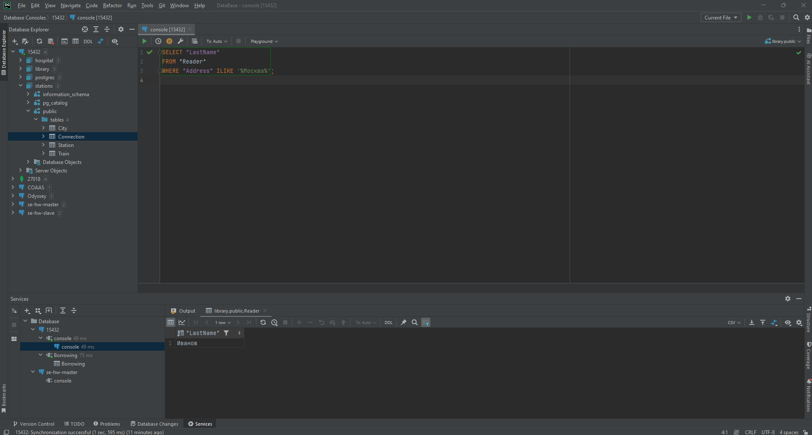
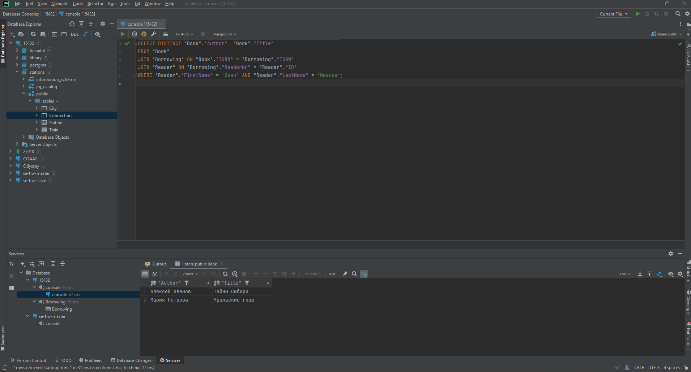
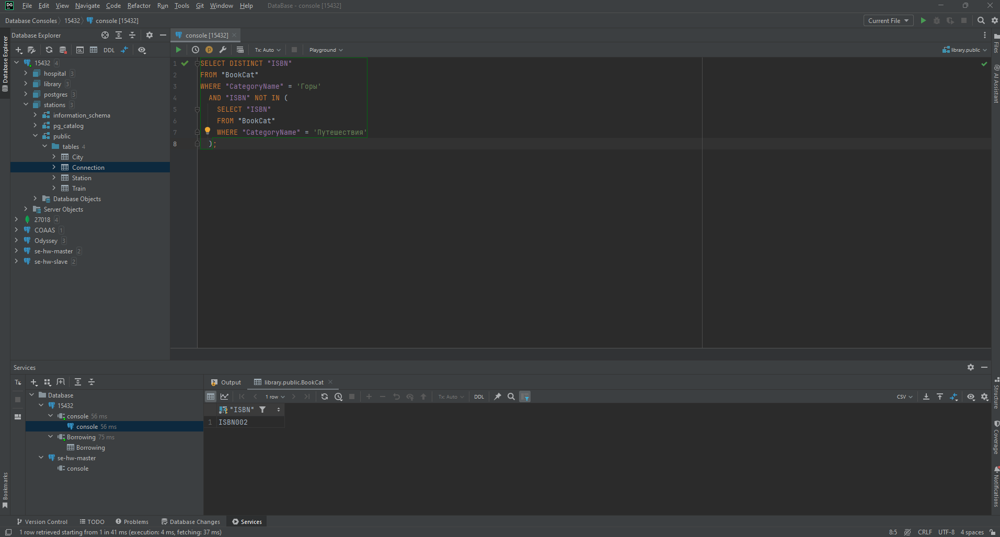
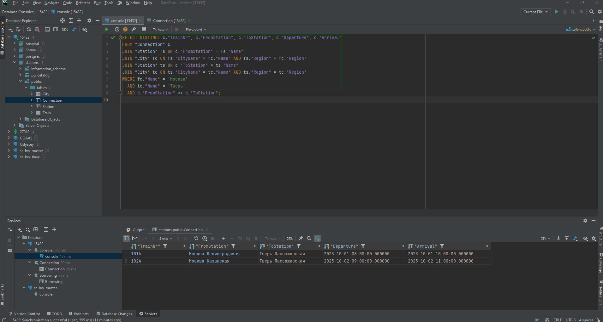
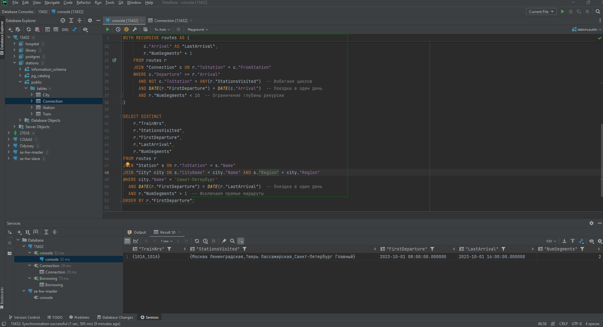

# Задание №5

## Шалаев Алексей БПИ 222

### Проводник

- **assets** - скриншоты с заданий
- **init-scripts** - миграции с созданием БД и наполнением данных
- **tasks** - SQL-скрипты - решения задач
- **docker-compose.yml** - Docker-compose с PostgreSQL

### Задача 1

- Какие фамилии читателей в Москве?  
- Какие книги (author, title) брал Иван Иванов?  
- Какие книги (ISBN) из категории "Горы" не относятся к категории "Путешествия"? Подкатегории не обязательно принимать во внимание!  
- Какие читатели (LastName, FirstName) вернули копию книги?  
- Какие читатели (LastName, FirstName) брали хотя бы одну книгу (не копию), которую брал также Иван Иванов (не включайте Ивана Иванова в результат)? 

### Задача 2

- Найдите все прямые рейсы из Москвы в Тверь.  
- Найдите все многосегментные маршруты, имеющие точно однодневный трансфер из Москвы в Санкт-Петербург (первое отправление и прибытие в конечную точку должны быть в одну и ту же дату). Вы можете применить функцию DAY () к атрибутам Departure и Arrival, чтобы определить дату.  